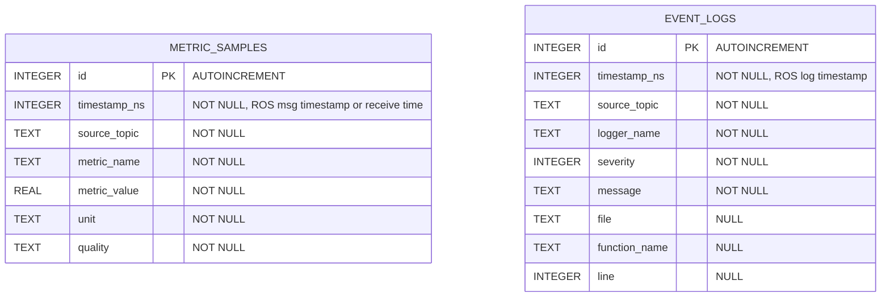

# robot_telemetry_server

Rust `rclrs` 기반 ROS 2 telemetry 수집 노드입니다. 여러 ROS topic을 subscribe하고, telemetry 값을 SQLite database에 기록합니다.

현재 DB write 연결은 `/odom`, `/imu`, `/scan`, `/cmd_vel`, `/battery_state`, `/tf`, `/rosout` topic에 적용되어 있습니다.

## Project Structure

```text
robot_telemetry_server/
├── Cargo.toml
├── package.xml
├── README.md
├── config/
│   └── robot_telemetry_server.yaml
├── launch/
│   └── robot_telemetry_server.launch.xml
└── src/
    ├── main.rs
    ├── lib.rs
    ├── state.rs
    ├── rcl/
    │   ├── mod.rs
    │   ├── node.rs
    │   └── params.rs
    ├── db/
    │   ├── mod.rs
    │   ├── schema.rs
    │   └── writer.rs
    └── collectors/
        ├── mod.rs
        ├── common.rs
        ├── odom.rs
        ├── imu.rs
        ├── scan.rs
        ├── battery.rs
        ├── rosout.rs
        ├── tf.rs
        └── twist.rs
```

## Module Roles

`src/main.rs`
- ROS context 생성
- executor 생성
- `RobotTelemetryServerNode` 생성
- `executor.spin()` 실행

`src/lib.rs`
- crate 내부 모듈 선언
- `RobotTelemetryServerNode`를 crate root로 re-export

`src/rcl/node.rs`
- `rclrs` node 생성
- worker 생성
- subscription 생성 및 보관
- callback에서 collector와 DB writer 호출
- C++ `rclcpp::Node` 클래스에 가까운 역할

`src/rcl/params.rs`
- ROS parameter declare/get 처리
- topic별 QoS 설정 변환
- DB path, batch size, flush interval parameter 처리
- parameter handle 보관 구조 정의

`src/state.rs`
- worker callback에서 공유하는 상태
- `Node` logger handle 보관
- SQLite writer handle 보관

`src/db/schema.rs`
- SQLite table 생성 SQL
- index 생성 SQL
- insert SQL 상수

`src/db/writer.rs`
- `rusqlite` connection 관리
- WAL, busy timeout 설정
- background writer thread 생성
- metric/event write command 처리

`src/collectors/common.rs`
- collector 공통 timestamp, sample 생성, finite stats helper

`src/collectors/*.rs`
- topic별 ROS message를 `MetricSample` 또는 `EventLog`로 변환
- `/odom`, `/imu`, `/scan`, `/cmd_vel`, `/battery_state`, `/tf`, `/rosout` telemetry 추출

## Parameters

기본 parameter file은 `config/robot_telemetry_server.yaml`입니다.

주요 설정:

```yaml
robot_telemetry_server:
  ros__parameters:
    db:
      path: "/home/rnc/ws/data/db/telemetry.db"
      batch_size: 100
      flush_interval_ms: 1000
    odom:
      topic: "/odom"
      qos:
        reliability: "reliable"
        depth: 10
        durability: "volatile"
```

Rust 쪽에서는 nested YAML key를 dot path로 declare합니다.

```text
db.path
db.batch_size
odom.topic
odom.qos.reliability
odom.qos.depth
odom.qos.durability
```

## SQLite Output

현재 DB에는 두 테이블을 생성합니다. `metric_samples`는 topic별 수치 telemetry를 long/narrow format으로 저장하고, `event_logs`는 `/rosout` 로그 이벤트 원문을 저장합니다.

```text
metric_samples
event_logs
```

### ERD



### Table Specification

#### metric_samples

| Column | Type | Null | Description |
| --- | --- | --- | --- |
| id | INTEGER | NO | Row primary key, autoincrement |
| timestamp_ns | INTEGER | NO | ROS message timestamp in nanoseconds. Headerless `/cmd_vel` uses receive time. |
| source_topic | TEXT | NO | Source ROS topic name from parameter config |
| metric_name | TEXT | NO | Stable metric identifier |
| metric_value | REAL | NO | Numeric metric value |
| unit | TEXT | NO | Unit label such as `m/s`, `rad/s`, `V`, `count`, `code` |
| quality | TEXT | NO | Metric quality flag. Current collectors write `ok`. |

Indexes:

| Index | Columns | Purpose |
| --- | --- | --- |
| idx_metric_samples_time | timestamp_ns | Time range query |
| idx_metric_samples_name_time | metric_name, timestamp_ns | Metric-series query |

#### event_logs

| Column | Type | Null | Description |
| --- | --- | --- | --- |
| id | INTEGER | NO | Row primary key, autoincrement |
| timestamp_ns | INTEGER | NO | ROS log timestamp in nanoseconds |
| source_topic | TEXT | NO | Source ROS topic name, normally `/rosout` |
| logger_name | TEXT | NO | ROS logger name |
| severity | INTEGER | NO | ROS log severity level |
| message | TEXT | NO | Log message body |
| file | TEXT | YES | Source file path from ROS log, if present |
| function_name | TEXT | YES | Source function from ROS log, if present |
| line | INTEGER | YES | Source line from ROS log, if present |

Indexes:

| Index | Columns | Purpose |
| --- | --- | --- |
| idx_event_logs_time | timestamp_ns | Time range query |
| idx_event_logs_severity_time | severity, timestamp_ns | Severity-filtered log query |

### Topic Metric Catalog

현재 기록 대상:

```text
/odom          -> metric_samples
/imu           -> metric_samples
/scan          -> metric_samples
/cmd_vel       -> metric_samples
/battery_state -> metric_samples
/tf            -> metric_samples
/rosout        -> metric_samples, event_logs
```

`/odom` (`nav_msgs/Odometry`):

| Metric | Unit | Description |
| --- | --- | --- |
| odom_position_x | m | Pose position x |
| odom_position_y | m | Pose position y |
| odom_position_z | m | Pose position z |
| odom_orientation_x | quaternion | Pose orientation quaternion x |
| odom_orientation_y | quaternion | Pose orientation quaternion y |
| odom_orientation_z | quaternion | Pose orientation quaternion z |
| odom_orientation_w | quaternion | Pose orientation quaternion w |
| odom_linear_x | m/s | Twist linear velocity x |
| odom_linear_y | m/s | Twist linear velocity y |
| odom_linear_z | m/s | Twist linear velocity z |
| odom_angular_x | rad/s | Twist angular velocity x |
| odom_angular_y | rad/s | Twist angular velocity y |
| odom_angular_z | rad/s | Twist angular velocity z |

`/imu` (`sensor_msgs/Imu`):

| Metric | Unit | Description |
| --- | --- | --- |
| imu_orientation_x | quaternion | Orientation quaternion x |
| imu_orientation_y | quaternion | Orientation quaternion y |
| imu_orientation_z | quaternion | Orientation quaternion z |
| imu_orientation_w | quaternion | Orientation quaternion w |
| imu_angular_velocity_x | rad/s | Angular velocity x |
| imu_angular_velocity_y | rad/s | Angular velocity y |
| imu_angular_velocity_z | rad/s | Angular velocity z |
| imu_linear_acceleration_x | m/s^2 | Linear acceleration x |
| imu_linear_acceleration_y | m/s^2 | Linear acceleration y |
| imu_linear_acceleration_z | m/s^2 | Linear acceleration z |

`/scan` (`sensor_msgs/LaserScan`):

| Metric | Unit | Description |
| --- | --- | --- |
| scan_angle_min | rad | Scan start angle |
| scan_angle_max | rad | Scan end angle |
| scan_angle_increment | rad | Angular distance between measurements |
| scan_time_increment | s | Time between measurements |
| scan_time | s | Time between scans |
| scan_range_min_limit | m | Sensor minimum valid range |
| scan_range_max_limit | m | Sensor maximum valid range |
| scan_range_count | count | Total range sample count |
| scan_valid_range_count | count | Finite range count inside configured limits |
| scan_invalid_range_count | count | Range count outside limits or non-finite |
| scan_range_min | m | Minimum valid range |
| scan_range_max | m | Maximum valid range |
| scan_range_mean | m | Mean valid range |
| scan_intensity_count | count | Finite intensity sample count |
| scan_intensity_min | intensity | Minimum intensity |
| scan_intensity_max | intensity | Maximum intensity |
| scan_intensity_mean | intensity | Mean intensity |

`/cmd_vel` (`geometry_msgs/Twist`):

| Metric | Unit | Description |
| --- | --- | --- |
| cmd_vel_linear_x | m/s | Commanded linear velocity x |
| cmd_vel_linear_y | m/s | Commanded linear velocity y |
| cmd_vel_linear_z | m/s | Commanded linear velocity z |
| cmd_vel_angular_x | rad/s | Commanded angular velocity x |
| cmd_vel_angular_y | rad/s | Commanded angular velocity y |
| cmd_vel_angular_z | rad/s | Commanded angular velocity z |

`/battery_state` (`sensor_msgs/BatteryState`):

| Metric | Unit | Description |
| --- | --- | --- |
| battery_voltage | V | Battery voltage |
| battery_current | A | Battery current |
| battery_temperature | C | Battery temperature |
| battery_charge | Ah | Battery charge |
| battery_capacity | Ah | Battery capacity |
| battery_design_capacity | Ah | Battery design capacity |
| battery_percentage | ratio | Battery percentage |
| battery_power_supply_status | code | ROS power supply status enum value |
| battery_power_supply_health | code | ROS power supply health enum value |
| battery_power_supply_technology | code | ROS power supply technology enum value |
| battery_present | bool | Battery present flag as 0 or 1 |
| battery_cell_voltage_count | count | Finite cell voltage sample count |
| battery_cell_voltage_min | V | Minimum cell voltage |
| battery_cell_voltage_max | V | Maximum cell voltage |
| battery_cell_voltage_mean | V | Mean cell voltage |
| battery_cell_temperature_count | count | Finite cell temperature sample count |
| battery_cell_temperature_min | C | Minimum cell temperature |
| battery_cell_temperature_max | C | Maximum cell temperature |
| battery_cell_temperature_mean | C | Mean cell temperature |

`/tf` (`tf2_msgs/TFMessage`):

| Metric | Unit | Description |
| --- | --- | --- |
| tf_transform_count | count | Transform count in the message |
| tf_translation_norm_min | m | Minimum translation vector norm |
| tf_translation_norm_max | m | Maximum translation vector norm |
| tf_translation_norm_mean | m | Mean translation vector norm |
| tf_rotation_angle_min | rad | Minimum normalized quaternion rotation angle |
| tf_rotation_angle_max | rad | Maximum normalized quaternion rotation angle |
| tf_rotation_angle_mean | rad | Mean normalized quaternion rotation angle |

`/rosout` (`rcl_interfaces/Log`):

| Metric | Unit | Description |
| --- | --- | --- |
| rosout_severity | level | ROS log severity level mirrored as metric |

DB 파일 확인:

```bash
sqlite3 /home/rnc/ws/data/db/telemetry.db ".tables"
sqlite3 /home/rnc/ws/data/db/telemetry.db ".schema"
```

metric 확인:

```bash
sqlite3 /home/rnc/ws/data/db/telemetry.db \
  -cmd ".headers on" \
  -cmd ".mode column" \
  "SELECT timestamp_ns, source_topic, metric_name, metric_value, unit, quality FROM metric_samples LIMIT 20;"
```

event log 확인:

```bash
sqlite3 /home/rnc/ws/data/db/telemetry.db \
  -cmd ".headers on" \
  -cmd ".mode column" \
  "SELECT timestamp_ns, logger_name, severity, message FROM event_logs LIMIT 20;"
```

WAL mode를 사용하므로 실행 중에는 다음 파일들이 함께 생길 수 있습니다.

```text
telemetry.db
telemetry.db-wal
telemetry.db-shm
```

## Build And Check

```bash
cargo fmt
cargo check
```

ROS workspace에서는 일반적으로 `colcon`/`ament_cargo` 흐름으로 빌드합니다.

```bash
colcon build --packages-select robot_telemetry_server
```

## Launch

```bash
ros2 launch robot_telemetry_server robot_telemetry_server.launch.xml
```

launch file은 `config/robot_telemetry_server.yaml`을 parameter file로 로드합니다.
